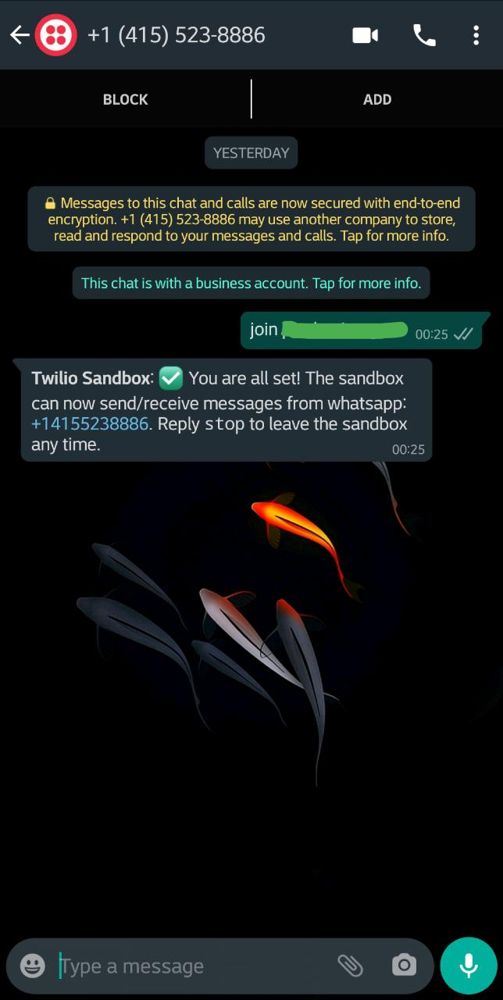
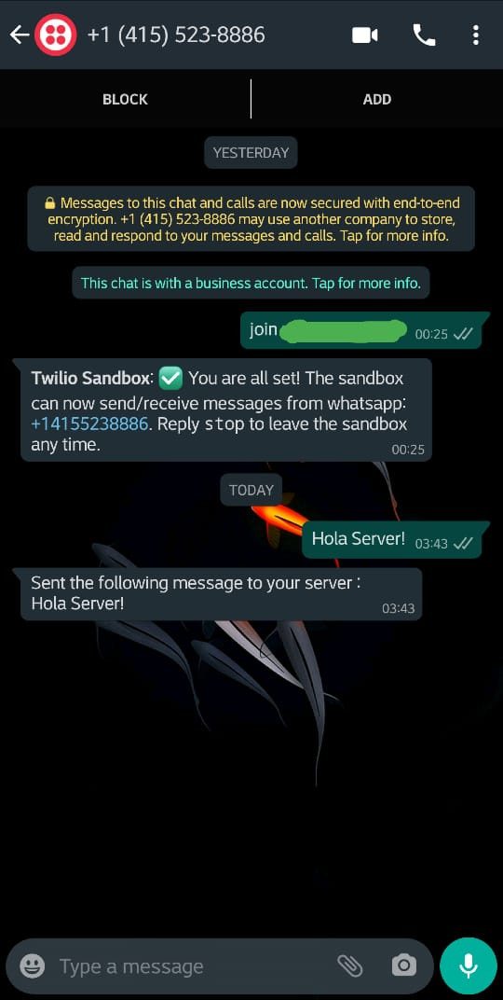

# Twilio Discord Webhook Worker

One can do lots of crazy stuff using **Twilio's API** for **Whatsapp**. This is my try on these super fun APIs.
This **Flask** server runs on top of **Gunicorn** Web Server Gateway, that I have hosted hosted on Heroku

## What it does  :
1. Listens to the incoming messages in Whatsapp after the User has connected to the Sandbox, by sending `join <SandBox_Name>`
2. POSTs messages to the Discord Server using the Webhook URL, by following the JSON norms mentioned in Discord Webhook Documentations.
3. Sends back a confirmation message to the user in WhatsApp on a successful callback.

# How to use : 
1. In your Discord Server, create a Webhook. You need `MANAGE_WEBHOOKS` permission for this.
2. Pull this repo, and create a file named _DiscordWHUrl.py_ to return the Webhook URL, or simply paste the URL in [line 12](app.py#L12)
3. Host this to the internet using **NGROK**, or host it on a PaaS like **Heroku**. This will be used by our Sandbox that we create in the next step,
4. Create an account on Twilio, and set up a **WhatsApp sandbox**.
5. In the Sandbox Configuration Page, add the link to the API that you hosted on the internet. (in this case, URL to [app.py](app.py) that we hosted in step 3). And you're done setting up the worker!
6. Now *"join"* the Sandbox by sending `join <SandBox_Name>`  

7. This step is self-explanatory :)  
  
> You receive it in the Server  
>   
---
This one was a quickie ;)
